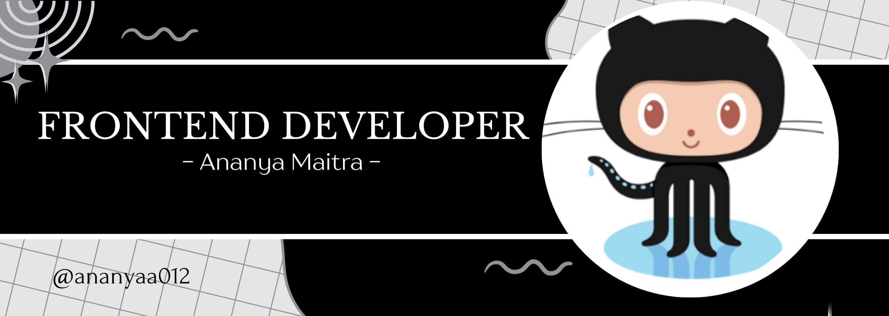

<h1 align="center">Hi 👋, I'm Ananya Maitra</h1>
<h3 align="center">A passionate frontend developer from India</h3>

  

  

- 🌱 I’m currently learning **HTML,CSS,Python.etc.**

- 📫 How to reach me **ananyya012@gmail.com**

<h3 align="left">Connect with me:</h3>

<h3 align="left">Languages and Tools:</h3>

          

